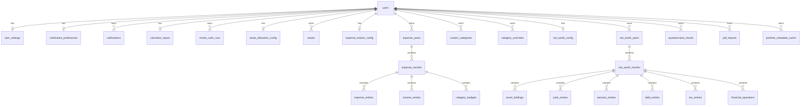

# Database Schema

Fire Tools' planned local-deployment backend stores data in a relational
database. This document describes the schema in [`schema.sql`](./schema.sql).

> **Status — contract only.** The backend itself is not yet implemented
> (tracked in issues [#189](https://github.com/mbianchidev/fire-tools/issues/189),
> [#195](https://github.com/mbianchidev/fire-tools/issues/195),
> [#222](https://github.com/mbianchidev/fire-tools/issues/222)). This schema
> defines the persistence contract that the future backend will honour.

---

## Design goals

1. **SQLite first-class, PostgreSQL compatible.** The single `schema.sql` runs
   unmodified under SQLite ≥3.38 and PostgreSQL ≥14.
2. **Single-user-by-default, multi-tenant-ready.** A `users` table exists from
   day one and every domain row carries a `user_id` FK. Single-user
   deployments use the bootstrap row (`id = 1`,
   `email = 'local@firetools.local'`); multi-tenant deployers simply add more
   rows and wire auth.
3. **Mirror the frontend type system.** Tables and columns map 1-to-1 to the
   TypeScript interfaces in [`src/types/`](../../src/types/). Enum values
   match the string literal unions exactly.
4. **Normalise what's queried, keep blobs for opaque payloads.** Per-row
   detail (assets, expenses, operations, …) is normalised. Bulk numerical
   payloads that are written and read as a whole (Monte Carlo simulation logs,
   PDF parse drafts, region/sector weightings) are stored as JSON `TEXT`.

## Compatibility notes

| Concern              | SQLite                                  | Postgres                                                                                                |
|----------------------|-----------------------------------------|---------------------------------------------------------------------------------------------------------|
| Primary keys         | `INTEGER PRIMARY KEY` (ROWID alias)     | Same. For server-side ID generation, deployers may swap to `INTEGER GENERATED BY DEFAULT AS IDENTITY`.  |
| Booleans             | `INTEGER` 0/1 with `CHECK`              | Same — Postgres accepts it. Optional upgrade: `BOOLEAN` column type.                                    |
| Enums                | `TEXT` + `CHECK (... IN (...))`         | Same. Optional upgrade: native `CREATE TYPE ... AS ENUM`.                                               |
| Timestamps           | `TEXT` ISO-8601 (`CURRENT_TIMESTAMP`)   | Same. Optional upgrade: `TIMESTAMPTZ`.                                                                  |
| Money                | `REAL`                                  | Same. Accounting-grade deployments may upgrade to `NUMERIC(18,4)`.                                      |
| JSON blobs           | `TEXT` (JSON1 ext available)            | Same. Optional upgrade: `JSONB` for indexed JSON queries.                                               |
| Foreign keys         | **Must enable per connection** with `PRAGMA foreign_keys = ON;` | Enabled by default.                                                                     |
| Cascading deletes    | `ON DELETE CASCADE`                     | Same.                                                                                                   |

All upgrades above are **optional optimisations** for Postgres-only
deployments; the portable schema is a strict subset and continues to work.

## How to load

### SQLite
`PRAGMA foreign_keys` is a **per-connection** setting that is *not* persisted in
the database file, so it must be enabled on every connection that needs FK
enforcement (including the one that loads the schema):
```sh
sqlite3 firetools.db <<'SQL'
PRAGMA foreign_keys = ON;
.read docs/database/schema.sql
SQL
```

### PostgreSQL
```sh
createdb firetools
psql firetools -f docs/database/schema.sql
```

## Entity-relationship overview



`banks` is global (no `user_id`) and acts as a seedable lookup.

## Table reference

### Identity
- **`users`** — root tenant. Bootstrap row (`id = 1`) auto-inserted.

### Settings & notifications
- **`user_settings`** — UI preferences, default currency, FIRE inclusion
  toggles, experimental feature flags, optional LLM-categorization config.
- **`notification_preferences`** — per-channel toggles, email cadence,
  tax-reminder schedule.
- **`notifications`** — in-app notification feed; `external_id` mirrors the
  client-minted `notif-*` id so offline-generated entries can sync.

### FIRE calculator
- **`calculator_inputs`** — one row per user; all calculator form fields.
- **`monte_carlo_runs`** — one row per run. Per-simulation yearly detail is
  stored in `logs_json` (only when the user opts into logging).

### Asset allocation
- **`asset_allocation_config`** — display currency, tolerance, allow-negative.
- **`assets`** — every holding with class, sub-type, target mode, mortgage
  fields (for real estate), and Yahoo-fetched market price.

### Cashflow tracker (expenses + income)
- **`expense_tracker_config`** — currency, current year/month focus.
- **`expense_years`** → **`expense_months`** → **`expense_entries`** /
  **`income_entries`** / **`category_budgets`**.
- **`custom_categories`** — user-defined categories.
- **`category_overrides`** — UI customisation of built-in categories.

### Net worth tracker
- **`net_worth_config`** — currency, focus, pension/sync toggles.
- **`net_worth_years`** → **`net_worth_months`** → child tables:
  - `asset_holdings` (with embedded vehicle depreciation + mortgage info)
  - `cash_entries`
  - `pension_entries`
  - `debt_entries`
  - `tax_entries`
  - `financial_operations`

### Optional / experimental
- **`questionnaire_results`** — FIRE persona quiz outcomes; one row per
  completion (history kept).
- **`pdf_imports`** — drafts parsed from receipts/statements/payslips.
- **`portfolio_metadata_cache`** — Yahoo metadata per ticker, cached.

### Lookup
- **`banks`** — read-mostly bank/broker list with OpenBanking support flag.
  Backend should seed from [`src/types/bank.ts`](../../src/types/bank.ts);
  deployers may add rows.

## ID strategy

Two id columns coexist on most tables:

- **`id`** (`INTEGER`) — server-side surrogate primary key.
- **`external_id`** (`TEXT`) — client-minted stable id (`txn-...`, `nw-...`,
  `notif-...`, etc.) that the React app already generates locally. The
  `(user_id, external_id)` unique constraint makes upsert-from-client safe.

This avoids ID collisions when the same user syncs from multiple devices
before the backend assigns a numeric id.

## Multi-tenant migration path

The schema is multi-tenant on day one — only the *number of users* is
restricted by deployment policy, not by schema. To migrate:

1. Add new rows to `users`.
2. Add an auth layer (the OpenAPI spec already reserves a bearer
   `securityScheme`; see [`../api/openapi.yaml`](../api/openapi.yaml)).
3. Backend enforces `user_id = current_user.id` on every query.
4. No DDL changes required.

## Out of scope (deferred)

- **Migrations runner.** A future PR will introduce a migration tool
  (e.g. `node-pg-migrate` for Postgres, `goose` or `dbmate` for either).
  Until then, `schema.sql` is the only DDL artifact.
- **Audit log table.** Tracked separately in
  [#188](https://github.com/mbianchidev/fire-tools/issues/188).
- **Backups, encryption-at-rest, role grants.** Deployer concern.
