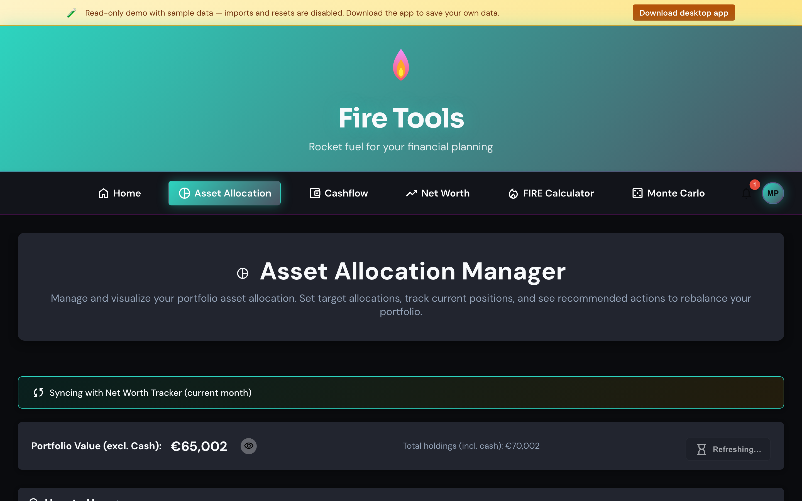

# Asset allocation manager

Track your portfolio, compare it against your target allocation and get
buy / sell / hold rebalancing hints.

## Adding assets

1. Click **Add asset**.
2. Pick a class (Stocks, Bonds, Real estate, Commodities, Cash).
3. Enter a label, a value and (optionally) a Yahoo Finance ticker. If you set
   a ticker, the app can refresh the price on demand.
4. Save.

Repeat for every position. The chart and the breakdown table update in
real time.

## Setting a target allocation

Open **Target allocation** and assign a target percentage to each asset
class. The targets must sum to 100%. The rebalancing column tells you, per
class, how much to **buy** or **sell** to get back on target. Holdings within
1% of target are flagged as **hold**.

## Refreshing prices

Prices are fetched directly from your browser to Yahoo Finance. No backend
proxy, no third-party analytics — the request is opt-in and only fires when
you press **Refresh prices**.

## Export / Import

Use **Export CSV** to grab a snapshot. Use **Import CSV** to load it back, or
to seed the app from a spreadsheet you maintain elsewhere. The schema is
documented in the header row of the exported file.

## Tips

- Don't chase precision. A target like *80 / 12 / 5 / 3* (stocks / bonds /
  REITs / cash) is plenty granular for most plans.
- Rebalance when an asset class drifts more than ~5% from its target, or once
  a year — whichever comes first.
