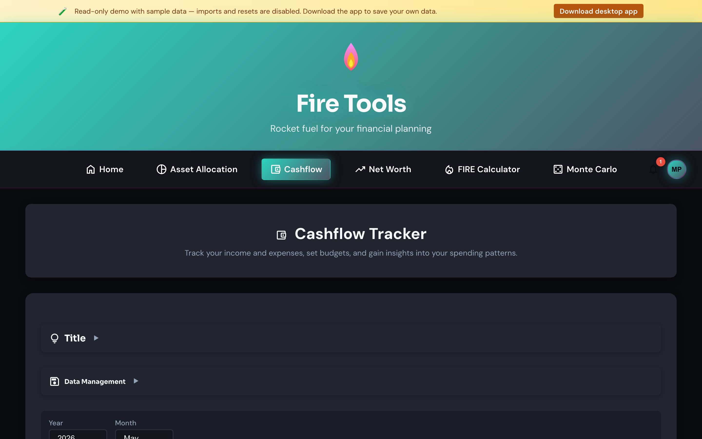

# Expense tracker

A lightweight ledger for monthly cash flow. Use it to figure out your *real*
annual expenses (the number that drives the FIRE target) instead of guessing.

## How to use it

1. **Add categories** (e.g. *Rent*, *Groceries*, *Transport*, *Travel*) under
   Settings → Categories, or accept the defaults.
2. **Add a transaction**: pick a date, category, currency and amount; the
   currency conversion is optional.
3. The ledger groups transactions by month and shows totals per category.

## Importing from your bank

Use **Import PDF** to upload a bank statement. Fire Tools includes lightweight
extractors for a handful of common European bank PDF layouts (see
[`docs/pdf-import.md`](https://github.com/mbianchidev/fire-tools/blob/main/docs/pdf-import.md) for the supported list and how to
contribute one). Imported rows land in a staging table where you can map them
to categories before committing.

## Linking to the FIRE calculator

The bottom of the page shows the **annualised expenses** derived from the
last 12 months of entries. Use that number as the *Annual expenses* input in
the [FIRE calculator](./fire-calculator.md) to make your projection match
reality.
