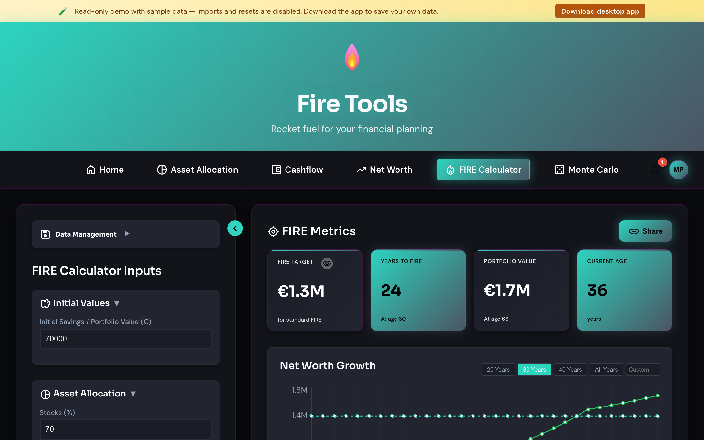

# FIRE calculator

Projects how many years it takes to reach financial independence at your
current savings rate, with adjustable expected return and inflation.

## How to use it

1. **Current net worth** — total of all investable assets today.
2. **Monthly savings** — the slice of your income that goes into investments
   each month. Be honest with yourself.
3. **Annual expenses** — what your life costs per year. The FIRE number is
   derived from this (25× by default, configurable as the *withdrawal rate*).
4. **Expected return** — long-term real return on your portfolio. The default
   sits around 7% for a global equity-heavy mix.
5. **Inflation** — used to keep targets in today's money.
6. **Withdrawal rate** — the slice you pull from the portfolio each year in
   retirement. 4% is the classic Trinity number; lower it for a safer plan.

Every change recalculates immediately and updates the projection chart.

## Reading the chart

- The line shows projected net worth year by year.
- The horizontal line is your FIRE target (`expenses / withdrawal_rate`).
- Where the curve crosses the target is your FIRE date.

## Sharing a scenario

Inputs are encoded in the URL. Copy the URL out of the address bar and share
— recipients open the same scenario without any data leaving either device.

## Exporting

Use **Export CSV** to download the inputs and the year-by-year projection.
Use **Import CSV** to load a previously exported file.

## Caveats

- The projection is deterministic. Run the
  [Monte Carlo simulation](./monte-carlo.md) if you want to see how volatility
  affects success rate.
- The expected return is a *real* return (after inflation). If you input a
  nominal return, set inflation to zero so you don't double-count it.
