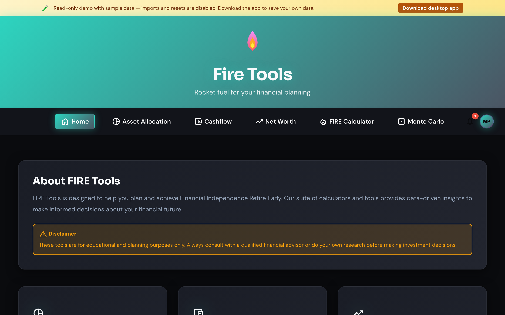

# Homepage & navigation

The homepage is the launchpad for every tool. From here you can dive into the
calculator, the asset allocation manager or any of the trackers.

## What you see

- **Top navigation** — links to every tool. The link for the page you're on is
  highlighted.
- **Tool cards** — one card per feature with a short description.
- **Language and currency** are remembered across sessions and follow you to
  every tool.

## Tips

- The site is keyboard accessible. Use `Tab` to move between cards and `Enter`
  to open the highlighted tool.
- Need to start fresh? Open [Settings](./settings.md) and use **Clear all
  data** — your local store is wiped (SQLite DB on desktop, encrypted cookies
  in browser) and the app reloads empty.
