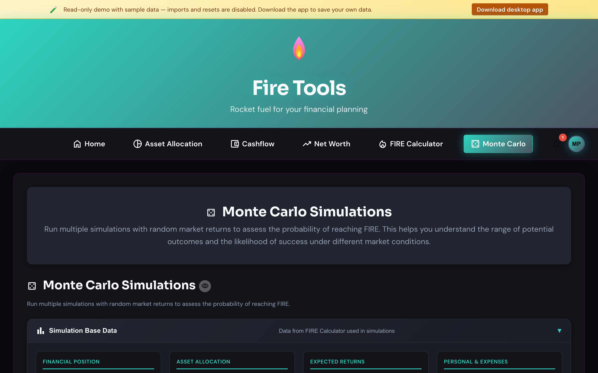

# Monte Carlo simulation

Where the [FIRE calculator](./fire-calculator.md) plots a single deterministic
line, Monte Carlo runs your plan thousands of times with randomised annual
returns to give you a *probability* of success.

## How to use it

1. Pick up the inputs from the FIRE calculator (or set them here).
2. Set the **volatility** (standard deviation of annual returns). 15% is a
   reasonable default for a global equity portfolio.
3. Optionally enable **black-swan events** — sporadic large drawdowns sampled
   from a fat-tail distribution. Use this if you want to stress-test the plan
   against a 2008-style year.
4. Set the **number of runs**. More runs = smoother distribution. 1000 is a
   good starting point; the math runs in the browser so feel free to push to
   10,000+.

## Reading the chart

- The shaded band is the spread between the 5th and 95th percentile outcomes.
- The center line is the median.
- The percentage at the top is the share of runs that ended at or above your
  FIRE target — your **success rate**.

## What to look for

- A success rate below ~80% means your plan is fragile to bad sequences of
  returns. Lower your withdrawal rate, save more, or extend the horizon.
- A very wide band means your plan is highly sensitive to luck. Diversifying
  across asset classes (see the [Asset allocation manager](./asset-allocation.md))
  is one way to narrow it.
