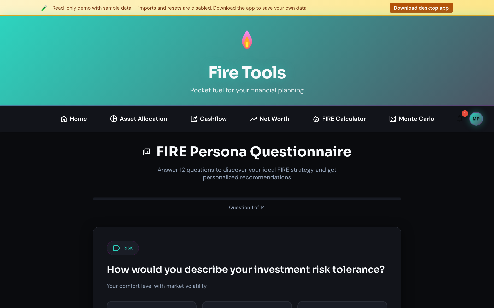

# Questionnaire (guided setup)

New to FIRE? Start here. The questionnaire is a short interview that
pre-fills the calculator and the asset allocation manager from your answers.

## What it asks

- Current age and target retirement age.
- Annual income (net) and monthly spend.
- Existing net worth, split roughly by asset class.
- Risk appetite (used to suggest a target allocation).
- Country / currency (used to pick reasonable defaults for return and
  inflation; not financial advice).

## What it produces

- A pre-filled FIRE calculator scenario you can tweak.
- A target asset allocation matching your risk appetite.
- A short summary you can re-open from the homepage.

You can skip any question. The questionnaire never blocks you from a tool —
it's just a faster way to bootstrap if you don't know where to start.
