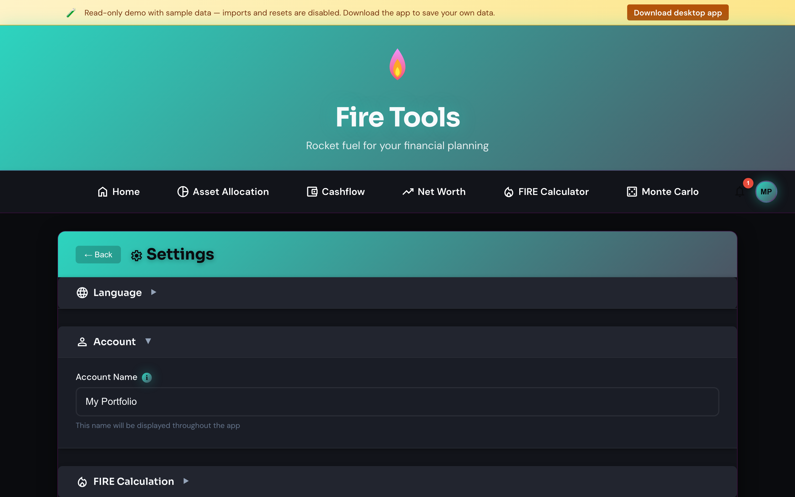

# Settings, language, data management

Everything that controls how Fire Tools looks and behaves lives on this page.

## Currency

Pick the currency the app displays everywhere. The setting is global and
applies to the calculator, trackers and allocation manager. Currency does
**not** convert your existing entries — values are stored in the currency in
which you entered them.

## Language

Choose between English (default), Italian, French, German or Spanish. The UI
updates immediately without a reload. Missing translations fall back to
English so a partial release never breaks the app.

Language is independent of currency. Switching to Italian doesn't change your
numbers from euros to lire, and switching to USD doesn't change the UI to
American English.

## Theme

Light, dark and system-auto are supported. The choice is remembered across
sessions.

## Experimental features

Beta features (e.g. the **Portfolio breakdown** view) live behind a toggle so
they're opt-in until they stabilise.

In the public **web demo** every experimental feature is enabled by default so
visitors can explore the full app without flipping toggles. The desktop app and
self-hosted builds keep them opt-in (all off until you enable them here).

## Data management

- **Export all data** — bundles every tool's state into a single ZIP with one
  CSV per tool. Use this for backups.
- **Import data** — restores a previously exported bundle. Use it on a new
  device or after **Clear all data**.
- **Clear all data** — wipes your local store (SQLite DB on desktop, encrypted
  cookies in browser). The app reloads empty. There is no undo; export first
  if you might want the data back.

## Audit log

The **Audit log** panel records meaningful actions you take — creating,
editing or deleting assets, running the FIRE calculation, changing a setting,
and importing or exporting data — so you can answer *"what did I just change?"*.

- **Filter** by action type and date range, and expand any row for its details.
- **Clear audit log** empties only the log (your data is untouched).
- It is bounded to the most recent entries and stored with the same AES-256
  encryption as the rest of your data.

The log is **private by design**: it stays on your device, records only
non-sensitive context (never amounts, tickers or account values), and is never
exported off device.

## Privacy

- **Desktop app** — data lives in a local SQLite database under the OS
  `userData` directory. Migrations run automatically on startup. Nothing is
  transmitted to a server unless you opt in.
- **Browser** — sensitive data is AES-256-encrypted and stored in cookies
  (with a localStorage fallback for environments where cookies are blocked).
  Cookies are flagged `Secure` and `SameSite=Strict`.

The only outbound calls are explicit opt-ins (e.g. the on-demand price refresh
on the [Asset allocation page](./asset-allocation.md)).
